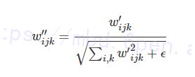

# 1.研究背景
随着互联网的发展与移动设备的普及，越来越多的人在社交媒体上分享个人图像。人像摄影流行的同时促进了人脸图像编辑技术的快速发展。传统的人脸图像编辑技术包括添加面部装饰（如眼镜、胡子）以及修饰容颜。基于生成对抗网络的人脸图像编辑方法能够改变人脸的固有属性（如年龄、性别）。人脸图像的年龄属性编辑技术在娱乐社交、影视媒体和智能安防等领域有着良好的应用前景和价值，能够广泛应用于人脸特效制作、帮助寻找失踪儿童、跨年龄段的人脸识别数据合成等任务。

# 2.图片演示


# 3.视频演示
[改进StyleGANv2的容貌年龄预测系统（源码＆教程）_哔哩哔哩_bilibili](https://www.bilibili.com/video/BV1ZR4y1D7BB/?vd_source=bc9aec86d164b67a7004b996143742dc)


# 4.StyleGAN2介绍
StyleGAN2 的出现当然是因为StyleGAN存在瑕疵，少量生成的图片有明显的水珠，这个水珠也存在于feature map上，如下图：


导致水珠的原因是 Adain 操作，Adain对每个feature map进行归一化，因此有可能会破坏掉feature之间的信息。emmmm，懵懵懂懂，最重要的是实验证明 当去除Adain的归一化操作后，水珠就消失了，所以Adain就背锅吧。
上面两张图说明了从 styleGAN 到 styleGAN2 ，在网络结构上的变换，去除normalization之后水珠消失了，但是styleGAN的一个亮点是 style mixing，仅仅只改网络结构，虽然能去除水珠，但是无法对style mixing 有 scale-specific级别的控制。

# 5.StyleGAN2 的改进点

#### AdaIN

StyleGAN第一个版本提出了通过AdaIN模块来实现生成，这个模块非常好也非常妙。


#### 权重解调
虽然我们修改了[网络结构](https://mbd.pub/o/bread/Y5qalZpu)，去除了水滴问题，但是styleGAN的目的是对特征实现可控的精细的融合。

StyleGAN2说，style modulation可能会放大某些特征的影像，所以style mixing的话，我们必须明确的消除这种影像，否则后续层的特征无法有效的控制图像。如果他们想要牺牲scale-specific的控制能力，他们可以简单的移除normalization，就可以去除掉水滴伪影，这还可以使得FID有着微弱的提高。现在他们提出了一个更好的替代品，移除伪影的同时，保留完全的可控性。这个就是weight demodulation。

我们继续看这个图：


里面包含三个[style block](https://afdian.net/item?plan_id=fe97875e566611ed861a52540025c377)，每一个block包含modulation（Mod），convolution and normalization。

modulation可以影响着卷积层的输入特征图。所以，其实Mod和卷积是可以继续宁融合的。比方说，input先被Mod放大了3倍，然后在进行卷积，这个等价于input直接被放大了3倍的卷积核进行卷积。Modulation和卷积都是在通道维度进行操作。所以有如下公式：


接下来的norm部分也做了修改：


这里替换了对特征图做归一化，而是去卷积的参数做了一个归一化，先前有研究提出，这样会有助于GAN的训练。
至此，我们发现，Mod和norm部分的操作，其实都可以融合到卷积核上。

```
class GeneratorBlock(nn.Module):
    def __init__(self, latent_dim, input_channels, filters, upsample = True, upsample_rgb = True, rgba = False):
        super().__init__()
        self.upsample = nn.Upsample(scale_factor=2, mode='bilinear', align_corners=False) if upsample else None

        self.to_style1 = nn.Linear(latent_dim, input_channels)
        self.to_noise1 = nn.Linear(1, filters)
        self.conv1 = Conv2DMod(input_channels, filters, 3)
        
        self.to_style2 = nn.Linear(latent_dim, filters)
        self.to_noise2 = nn.Linear(1, filters)
        self.conv2 = Conv2DMod(filters, filters, 3)

        self.activation = leaky_relu()
        self.to_rgb = RGBBlock(latent_dim, filters, upsample_rgb, rgba)

    def forward(self, x, prev_rgb, istyle, inoise):
        if exists(self.upsample):
            x = self.upsample(x)

        inoise = inoise[:, :x.shape[2], :x.shape[3], :]
        noise1 = self.to_noise1(inoise).permute((0, 3, 2, 1))
        noise2 = self.to_noise2(inoise).permute((0, 3, 2, 1))

        style1 = self.to_style1(istyle)
        x = self.conv1(x, style1)
        x = self.activation(x + noise1)

        style2 = self.to_style2(istyle)
        x = self.conv2(x, style2)
        x = self.activation(x + noise2)

        rgb = self.to_rgb(x, prev_rgb, istyle)
        return x, rgb
```
可以发现，这个噪音也会经过Linear层的简单变换，然后里面加入了残差。为什么要输出rgb图像呢？这个会放在下次，或者下下次的内容。styleGAN1是需要用progressive growing的策略的，而StyleGAN2使用新的架构，解决了这种繁琐的训练方式。

# 6.代码实现
```
def get_lr(t, ts, initial_lr, final_lr):
    alpha = pow(final_lr/initial_lr, 1/ts)**(t*ts)

    return initial_lr * alpha


def project(
    imgs: List[PIL.Image.Image],
    masks: List[PIL.Image.Image] = None,
    generator = None,
    pSp = None,
    ckpt: arg_type(str, help="path to the model checkpoint") = None,
    model_type: arg_type(str, help="inner model type. `ffhq-config-f` for default genrator and `ffhq-inversion` for pSp") = None,
    size: arg_type(int, help="original output image resolution") = 1024,
    style_dim: arg_type(int, help="dimensions of style z") = 512,
    n_mlp: arg_type(int, help="the number of multi-layer perception layers for style z") = 8,
    channel_multiplier: arg_type(int, help="channel product, affect model size and the quality of generated pictures") = 2,
    start_lr: arg_type(float, help="learning rate at the begin of training") = 0.1,
    final_lr: arg_type(float, help="learning rate at the end of training") = 0.025,
    latent_level: arg_type(List[int], help="indices of latent code for training") = [0,1,2,3,4,5,6,7,8,9,10,11,12,13,14,15,16,17],
    step: arg_type(int, help="optimize iterations") = 100,
    mse_weight: arg_type(float, help="weight of the mse loss") = 1,
    no_encoder: arg_type(
       'project:no_encoder', action="store_true", 
       help="disable to use pixel2style2pixel model to pre-encode the images"
    ) = False,
):
    n_mean_latent = 4096

    transform = transforms.Compose(
        [
            transforms.Resize(256),
            transforms.CenterCrop(256),
            transforms.Transpose(),
            transforms.Normalize([127.5, 127.5, 127.5], [127.5, 127.5, 127.5]),
        ]
    )

    _imgs = []
    _masks = []
    if masks is None:
        masks = [Image.new(mode='L', size=img.size, color=255) for img in imgs]
    for img, mask in zip(imgs, masks):
        assert isinstance(img, PIL.Image.Image) and isinstance(mask, PIL.Image.Image)
        img = paddle.to_tensor(transform(img))
        mask = (paddle.to_tensor(transform(mask.convert('RGB')))[:1] + 1) / 2
        _imgs.append(img)
        _masks.append(mask)

    imgs = paddle.stack(_imgs, 0)
    masks = paddle.stack(_masks, 0)

    percept = lpips.LPIPS(net='vgg')
    percept.train() # on PaddlePaddle, lpips's default eval mode means no gradients.

    if generator is not None:
        no_encoder = True
    if pSp is None:
        no_encoder = False
    if no_encoder:
        generator = generator if generator is not None else get_generator(
            weight_path=None if ckpt is None else ckpt,
            model_type='ffhq-config-f' if model_type is None else model_type,
            size=size,
            style_dim=style_dim,
            n_mlp=n_mlp,
            channel_multiplier=channel_multiplier
        )
        # generator.eval() # on PaddlePaddle, model.eval() means no gradients.

        with paddle.no_grad():
            noise_sample = paddle.randn((n_mean_latent, style_dim))
            latent_out = generator.style(noise_sample)

            latent_mean = latent_out.mean(0)

        latent_in = latent_mean.detach().clone().unsqueeze(0).tile((imgs.shape[0], 1))
        latent_in = latent_in.unsqueeze(1).tile((1, generator.n_latent, 1)).detach()

    else:
        pSp = pSp if pSp is not None else get_pSp(
            weight_path=None if ckpt is None else ckpt,
            model_type='ffhq-inversion' if model_type is None else model_type,
            size=size,
            style_dim=style_dim,
            n_mlp=n_mlp,
            channel_multiplier=channel_multiplier
        )
        # pSp.eval() # on PaddlePaddle, model.eval() means no gradients.
        generator = pSp.decoder
        
        with paddle.no_grad():
            _, latent_in = pSp(imgs, randomize_noise=False, return_latents=True)
        latent_in = latent_in.detach().clone()
    
    var_levels = list(latent_level)
    const_levels = [i for i in range(generator.n_latent) if i not in var_levels]
    assert len(var_levels) > 0
    if len(const_levels) > 0:
        latent_fix = latent_in.index_select(paddle.to_tensor(const_levels), 1).detach().clone()
        latent_in = latent_in.index_select(paddle.to_tensor(var_levels), 1).detach().clone()

    latent_in.stop_gradient = False

    optimizer = optim.Adam(parameters=[latent_in], learning_rate=start_lr)

    frames = []

    pbar = tqdm(range(step))

    latent_n = latent_in
    for i in pbar:
        t = i / step
        lr = get_lr(t, step, start_lr, final_lr)
        optimizer.set_lr(lr)

        if len(const_levels) > 0:
            latent_dict = {}
            for idx, idx2 in enumerate(var_levels):
                latent_dict[idx2] = latent_in[:,idx:idx+1]
            for idx, idx2 in enumerate(const_levels):
                latent_dict[idx2] = (latent_fix[:,idx:idx+1]).detach()
            latent_list = []
            for idx in range(generator.n_latent):
                latent_list.append(latent_dict[idx])
            latent_n = paddle.concat(latent_list, 1)

        img_gen, _ = generator([latent_n], input_is_latent=True, randomize_noise=False)
        frames.append(make_image(img_gen))

        batch, channel, height, width = img_gen.shape

        if height > 256:
            factor = height // 256

            img_gen = img_gen.reshape(
                (batch, channel, height // factor, factor, width // factor, factor)
            )
            img_gen = img_gen.mean([3, 5])

        p_loss = percept(img_gen*masks, (imgs*masks).detach()).sum()
        mse_loss = F.mse_loss(img_gen*masks, (imgs*masks).detach())
        loss = p_loss + mse_weight * mse_loss

        optimizer.clear_grad()
        loss.backward()
        optimizer.step()

        pbar.set_description(
            (
                f"perceptual: {p_loss.numpy()[0]:.4f}; "
                f"mse: {mse_loss.numpy()[0]:.4f}; lr: {lr:.4f}"
            )
        )

    img_gen, _ = generator([latent_n], input_is_latent=True, randomize_noise=False)
    frames.append(make_image(img_gen))

    imgs_seq = [[] for _ in range(img_gen.shape[0])]
    for i in range(img_gen.shape[0]):
        for frame in frames:
            imgs_seq[i].append(frame[i])
    
    return imgs_seq, latent_n


if __name__ == "__main__":
    import argparse
    import os

    from utils import save_video
    from crop import align_face

    parser = argparse.ArgumentParser(
        description="Image projector to the generator latent spaces"
    )
    parser, arg_names = func_args(parser, project)
    parser.add_argument(
        "--no_crop", action="store_true", help="disable to crop input images first"
    )
    parser.add_argument(
        "--save_mp4", action="store_true", help="saving training progress images as mp4 videos"
    )
    parser.add_argument(
        "files", metavar="FILES", nargs="+", help="path to image files to be projected"
    )
    parser.add_argument(
        "--output", type=str, default="./output", help="output directory"
    )

    args = parser.parse_args()

    imgs = []
    masks = []

    for imgfile in args.files:
        if args.no_crop:
            img = Image.open(imgfile)
            imgs.append(img)
            maskfile = '.'.join(imgfile.split('.')[:-1]) + '.mask.' + imgfile.split('.')[-1]
            if os.path.exists(maskfile):
                mask = Image.open(maskfile)
            else:
                mask = Image.new(mode='L', size=img.size, color=255)
            masks.append(mask)
        else:
            img, mask = align_face(imgfile)
            imgs.append(img)
            masks.append(mask)

    imgs_seq, latent_code = project(imgs, masks, **{arg_name: getattr(args, arg_name) for arg_name in arg_names})

    os.makedirs(args.output, exist_ok=True)
    for i, input_name in enumerate(args.files):

        code_name = os.path.join(
            args.output, 
            os.path.splitext(os.path.basename(input_name))[0] + ".pd"
        )
        latent_file = {
            "latent_code": latent_code[i],
        }
        paddle.save(latent_file, code_name)

        img_name = os.path.join(
            args.output, 
            os.path.splitext(os.path.basename(input_name))[0] + "-project.png"
        )
        pil_img = Image.fromarray(imgs_seq[i][-1])
        pil_img.save(img_name)

        if args.save_mp4:
            fps = 30
            duration = 5
            save_video(
                imgs_seq[i],
                os.path.join(
                    args.output, 
                    os.path.splitext(os.path.basename(input_name))[0] + "-project.mp4"
                ),
                fps, duration
            )
```

# 7.系统整合


# 8.[完整源码＆环境部署视频教程＆自定义UI界面](https://s.xiaocichang.com/s/1528f0)


# 9.参考文献
***
[1]徐莹.基于分层结构和稀疏表示的人脸老化模拟研究[J].中南大学.2012.DOI:10.7666/d.y2196806.
[2]Shuang Liu,Dan Li,Tianchi Cao,等.GAN-Based Face Attribute Editing[J].IEEE Access.2020.834854-34867.DOI:10.1109/ACCESS.2020.2974043.
[3]Lanitis, A.,Taylor, C.J.,Cootes, T.F..Toward automatic simulation of aging effects on face images[J].Pattern Analysis & Machine Intelligence, IEEE Transactions on.2002,24(4).442-455.
[4]Volker Blanz,Thomas Vetter.A Morphable Model For The Synthesis Of 3D Faces[J].Computer graphics.1999,33(0).
[5]Alfred Müller.Integral Probability Metrics and Their Generating Classes of Functions[J].Advances in applied probability.1997,29(2).429-443.DOI:10.1017/S000186780002807X.
[6]Bor-Chun Chen,Chu-Song Chen,Winston H. Hsu.Cross-Age Reference Coding for Age-Invariant Face Recognition and Retrieval[C].2014
[7]Jia Deng,Wei Dong,Socher, R.,等.ImageNet: A large-scale hierarchical image database[C].


---
#### 如果您需要更详细的【源码和环境部署教程】，除了通过【系统整合】小节的链接获取之外，还可以通过邮箱以下途径获取:
#### 1.请先在GitHub上为该项目点赞（Star），编辑一封邮件，附上点赞的截图、项目的中文描述概述（About）以及您的用途需求，发送到我们的邮箱
#### sharecode@yeah.net
#### 2.我们收到邮件后会定期根据邮件的接收顺序将【完整源码和环境部署教程】发送到您的邮箱。
#### 【免责声明】本文来源于用户投稿，如果侵犯任何第三方的合法权益，可通过邮箱联系删除。